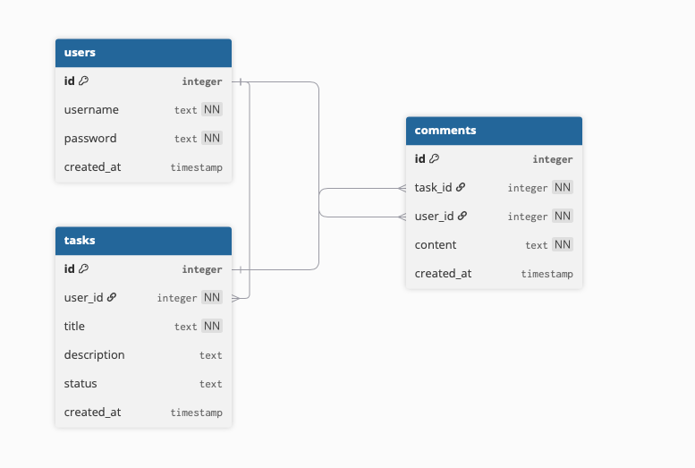

# Комментаторская
Пользователи могут получать задачи и писать к ним комментарии
## Стэк технолгий
Express, postgres, docker, alembic

# API Endpoints

## Users
### POST /users  
Создать пользователя  

### GET /users  
Получить список пользователей  

### GET /users/:id
Получить пользователя по id  

### DELETE /users/:id  
Удалить пользователя  

---

## Tasks
### POST /tasks  
Создать задачу  

### GET /tasks  
Получить список задач  

### GET /tasks/:id  
Получить задачу по id  

### PUT /tasks/:id  
Обновить задачу (например, статус)  

### DELETE /tasks/:id  
Удалить задачу  

---

## Comments
### POST /comments  
Добавить комментарий к задаче  

### GET /comments?task_id=:taskId  
Получить комментарии к задаче  

### DELETE /comments/:id  
Удалить комментарий  
